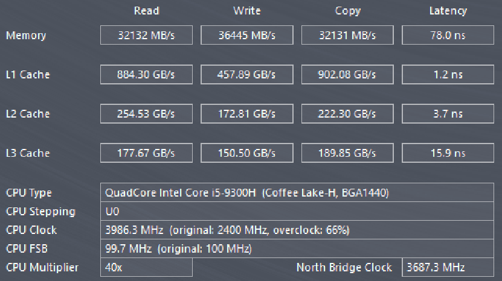
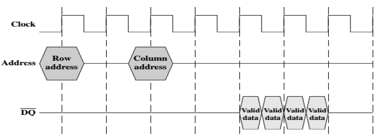
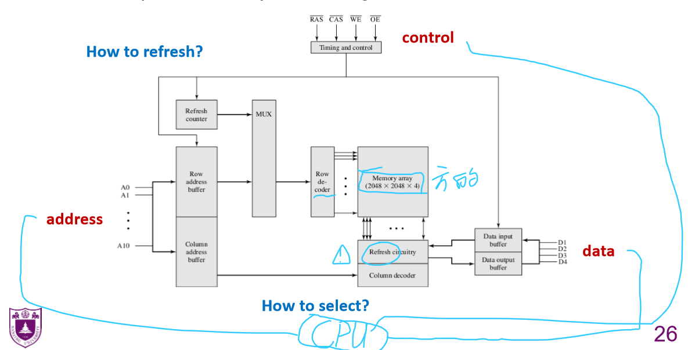

# Memory & Cache

> Powered by $YDJSIR$

内存设计瓶颈: 容量 速度 价格成本

实际要求:大容量 高速

解决方式:层次式设计

还是回顾一下存储金字塔吧

## Memory

> Lecture07

#### RAM

- 读取速度最快最容易
- 数据易丢失（必须维持供电）

###### 实机展示对比

可见SRAM还是比DRAM不知道高到哪里去了。

##### DRAM - Dynamic RAM - 用作内存

用电容充电存储数据，有电荷代表1，反之代表0。

它在本质上是一个模拟设备，需要用一个门槛值区分它存储的到底是0还是1。

###### 优点

- 比SRAM便宜；
- 比SRAM体积小，更容易大规模集成；

###### 缺点

- 由于电容会漏电，需要定期通电刷新，刷新期间无法读写；

  > 读取的时候也会消耗电荷，故读取后也需要重新存储。

- 比SRAM慢；

###### DRAM的刷新

- 集中式刷新

  停止所有读写操作，刷新每一行；

- 分散式刷新

  每个存储周期都刷新每一行（会增加每个存储周期的时间）

- 异步刷新（常见）

  每个`某时间间隔`刷新每一行（效率高）

具体方式请仔细读题。

##### SRAM - Static RAM - 用作Cache

用逻辑门电路存储数据，是数字设备。

（计基学过的R/S 锁存器、门控D锁存器还记得吗?）

###### 优点

- 比DRAM快；
- 不需要刷新；

###### 缺点

- 难以大规模集成；
- 比SRAM贵；

#### 高级DRAM组织

+ **问题**
  传统的DRAM 芯片受限于其内部结构及其与处理器的存储总线的连接. 
+ **解决方案**:
  + SDRAM(Synchronous DRAM)
  + DDR (DDR SDRAM)

##### SDRAM

+ 传统的 DRAM 是异步的.
  + 处理器将地址和控制信号提供给存储器,表示存储器中特定单元的一组数据应当被读出或写入DRAM.
  + 经过一段延时后,DRAM写入或读出数据.在这段时间内,DRAM 执行各种内部功能，如激活行地址线或列地址线的高电容， 读取数据，以及通过输出缓冲将数据输出,而处理器只是等待,降低了性能.
  + SDRAM 与处理器交换数据同步于外部时钟信号,可以以处理器/存储器总线全速运行,而不必等待.
  + 由于SDRAM随系统时钟移动数据,CPU 知道数据何时能够准备好.

##### DDR SDRAM

+ Double-data-rate SDRAM双速率 SDRAM.
+ 每个时钟周期发送两次数据,一次在脉冲上升沿,一次在下降沿.
+ DDR 技术的更迭
  + 提升操作频率
  + 提升预取缓冲器位数
    

#### 从位元到主存

##### 寻址

为什么内存序列做成方的？大大减少选择线的数量（上图只需要一纵一横的坐标就可以定位了）

###### 地址解码器

每次只有一个输出

##### 芯片-引脚

##### 模块组织

+ 字扩展
  + **增加了存储器中字的个数**,地址线增加,数据线不变.由**片选信号**来区分各芯片的地址范围.
+ 位扩展
  + 增加了字长.地址线不变,数据线增加.读写的时候,一个地址对应几块芯片的同一位置.
+ 字位扩展
  + 二者结合

###### 多个插槽拼起来做上面两种拓展

###### Main Memory

$Main\ memory = RAM + ROM$

$Main\ memory\ capacity = RAM\ capacity$

## Cache

> - Lecture08

运用一个更小更快的寄存器来减少内存的访问次数，是对主存的部分拷贝，处于CPU和主存之间 可能集成在CPU或其他模块中。

### Cache 工作的原理

+ Check :当处理器试图读取内存中的一个字的时候,会先检查该字是否在 Cache 中.
+ Hit : 如果确实在, 这个字被传送给处理器.
+ Miss : 否则,由一定数量的字组成的**一块( block )主存中的数据** 被读入 Cache ,然后传给处理器.
  
+ 时间局部性:
  未来将要使用的信息(指令和数据), 可能是现在正在使用的信息.
+ 空间局部性:
  未来将要使用的信息, 很可能与正在使用的信息在存储空间上是邻近的(比如遍历一个一维数组).

### 判断 Hit 与 Miss

冯诺依曼计算机中，内存中的内容按位置寻址,而不考虑其中的数据类型.

+ Cache 中有 标记(tag) 来判断需要读取的信息是否存在于 Cache.

### 移动"块"而不是字

### Cache 机制能够提高性能的证明 

+ 设命中率为 $p$, $T_C$ 为访问Cache 的时间,$T_M$ 为访问主存的时间,则总时间为

> 可以认为返回数据不需要时间, 寻找花时间

$$T_A = p T_C + (1-p)(T_C+T_M)$$

由上面可以推出,若 $T<T_M$, 则 $p>\frac{T_C}{T_M}$ ,虽然$\frac{T_C}{T_M}$非常小,但是 Cache 的容量更要远远小于主存的容量,这就体现了局部性的作用.

### Cache容量选择

Cache 容量变大, 命中率增加会变得缓慢,因为搬来的数据可能关联性弱,对效果提升十分有限.此外,Cache 规模变大会使得 check 的时间变长，成本也会急剧飙升。

#### 多级Cache

多级 cache 比单一大容量 cache 效率更高。在计算的时候分别计算命中率，然后运用概率论的知识去计算就可以了。

### 映射功能

因为 Cache 的行比主存块要少, 所以需要一个算法将主存中的块映射到 Cache 中的行，且冲突的可能性必然存在。

#### 直接映射

##### 地址组成

<iframe frameborder="0" style="width:100%;height:300px;" src="https://viewer.diagrams.net/?highlight=0000ff&edit=_blank&layers=1&nav=1#R3ZjLjpswFIafxstIsQlgliFh2kW7SqVZe8AFq4CRcUoyT187mDAMpFAVRsmsYv%2B%2BxOc7vy8CWLvs9EWQIvnOI5oCtI5OwNoDhCD0bPWjlbNRXAfWSixYZLRWOLBXasS1UY8somWno%2BQ8lazoiiHPcxrKjkaE4FW320%2Bedv%2B1IDHtCYeQpH31mUUyqVWM3Fb%2FSlmcNP8MHa9uyUjT2URSJiTi1RvJCoC1E5zLupSddjTV9Bou9binG63XhQmayykDkFnYb5IeTXBmYfLcRCv4MY%2BoHrAGll8lTNJDQULdWqkEKy2RWapqUBXNdFRIerq5JniNVHmE8oxKcVZdzABs2Bh3NKiqljRstOQN5Y3RiElufJ24jV8VDIJhHPdE43b4eKHom%2B11F%2BGfmvBH3bAYDjiOQ%2B3fQhfDo0jPviDhLyrHubQQ65okkvFcVVfeeh5sXpfaagDb0B660v4vbpset1JVQbAB%2Fh7gPQgw2EKwxSBwwVaJWxDYwNsDz9UF%2FAR8twdaoZBdiCRlsWYWKiRUKEEDY%2BqQ3pqGjEWRHu4LWrJX8nKZSvMtOMvlJUDbB%2FZez3WUvKyvmZl863QT4E2zLZoDv93DX%2F0Lfgdg%2B6LsgL82Tc1aHzghENtjGYFwqZQ4j3uSIKvr5M20kwTPgc39cGxzUYPvqK3sadjgLHbrP2PE30%2BAHQkTamS8%2BzynMB6%2FBgffknNkAU14Td2pe9%2Bb1%2Fq4PY%2F6j65yNeJeSeKHd%2BqqezsNOdVbyqioh%2FzHJyCKuiYe8LC1FND%2BvfWN5fThicJxpJulkOIe0mcuIoCcVCN8USeEE8trmA8MeYJvZ4Ksqu2Hpkvbm%2B91VvAH"></iframe>

+ 定义: 内存中的一个块映射到 Cache 中固定的行.

+ 将主存中的每个块映射到**固定**的可用 Cache 中行.直接映射可以表示为:
  $$ i=j\space mod\space m$$
  其中 i 为 Cache 行号, j 为主存块号, m 为 Cache 行数 .
  为了实现访问 Cache 每一个主存地址可以看作由**三个域**组成：

    + 低 $w$ 位标识某个块中的唯一一个存储单元(字节或字).
    + 剩余 $s$ 位标识了主存 $2^s$ 个块中的一个.
      + 其中 $r$ 位标识了 cache 中的行号(cache 的行数为 $m=2^r$)
      + $s-r$ 位为 tag 位.用以区分映射到同一行的不同块.

  ##### 总结

    + 地址长度: $(s+w)$ 位
    + 可寻址单元数: $2^{s+w}$
    + 块大小=行大小=$2^w$ 个存储单元(字节或字)
    + 主存的块数:$\frac{2^{s+w}}{2^w}=2^s$
    + Cache 行数:$m=2^r$
    + Cache 容量: $2^{r+w}$ 个字或者字节
    + 标记长度: $(s-r)$ 位

  ##### 举例
  $m=16K=2^{14},i=j\space mod\space 2^{14}$,用 16 进制 表示地址有
  
  |  cache 行  |     主存块的起始地址      |
  | :--------: | :-----------------------: |
  |     0      | 000000,010000,....FF0000  |
  |     1      | 000004,010004,...,FF0004  |
  |    ...     |            ...            |
  | $2^{14}-1$ | 00FFFC,01FFFC,...,FFFFFFC |
  
  地址24位,其中,高8位为 tag 位,若当前存在该行的标记数与地址中的相同,则14位标识 cache 行号,  低2位标识行中的4个字节(或者字);否则,前22位标识为从主存中取一块.取的主存块的地址为22位加两位0(因为块都是以4倍数开始的,每个块有4个单元)
  
+ **优点**:

  + check快,从主存中存取的时候快
  + tag 短,额外存储少.
  + 不会随着容量增大而变慢
  + 实现简单

+ **缺点**:

  + 容易发生**抖动**:用到的两个块映射到 cache 中的同一行,于是频繁的替换.
  + 命中率**低**

#### 全相联映射

##### 地址组成

<iframe frameborder="0" style="width:100%;height:300px;" src="https://viewer.diagrams.net/?highlight=0000ff&edit=_blank&layers=1&nav=1#R3ZdNj5swEIZ%2FzRwj8RGIOUJgt5eeUmnPXnDBKmBkTEn219cOBsKyUViVVM1eovE7tvE8Mx4C2Pvi%2BMxxlX1nCcnBMpIj2CFYlu0i%2BauEUyeYO9fslJTTRGujcKBvRIuGVhuakHoyUTCWC1pNxZiVJYnFRMOcs3Y67SfLp0%2BtcEpmwiHG%2BVx9oYnIOhVZu1H%2FRmia9U82Xa%2FzFLifrCOpM5yw9kKyI7D3nDHRWcVxT3IFr%2BfSrXu64h0OxkkplizQ5%2FqN80bHps8lTn2wnDVlQtR8A%2BygzagghwrHytvK9EotE0UuR6Y09XaEC3K8eiRzCFRWCGEFEfwkp%2Bhq6NG0I1nL0Fp2QXWrNayTmQ47jfFKQ4d8hZfxH8V%2FfBfsdR7oXjjM2zhkxVbKjBuenwKO419E3OYyQuxGAgvKSjnceMY62LwptY39URnNsQ20%2F4rbdsatlkOIthCEgEKIEPgm%2BAiiHfhS9CFywAvB2ykDPUGwm4GWKMQUIs5pqpjFEgnhUlDAqGxLvnYUNEnU8oCTmr7h1%2FNWim%2FFaCnOAToBOKHaqxGs7hrrSnXrThOAlpWttQZ%2BZ4a%2F%2FQx%2BF5BzVvYQGNrVn%2FWBE2Ii51ZGTPNeKXEft5NY9rSSF3YStAI2a8H7aGVs9%2Bq%2F3j%2Fsv9b8vXWj%2FwqcPvz9dqfXe7Pwj8Ia17svywvgP74A0XcN84OLb98LKJoBfWE8AcvNFcFXLq1UDFE%2BMOMB13XI23Ugy%2BH4IXX2XXyO2tEf"></iframe> 

定义: 内存中的块可以映射到 Cache 中的任意一行.

##### 总结

+ 地址长度 $s+w $位
+ 可寻址单元数 $2^{s+w}$ 个字(字节)
+ 块大小=行大小=$2^w$ 个字(字节)
+ 主存的块数:$\frac{2^{s+w}}{2^w}=2^s$
+ cache 的行数: 不由地址格式决定
+ 标记长度=$s$ 位

##### **优点**

+ 避免"**抖动**".
+ 命中率高

##### **缺点**:

+ check 慢, 从内存中放到 cache 中慢.
+ 实现较为复杂 

#### 组相联映射

##### 地址组成

<iframe frameborder="0" style="width:100%;height:258px;" src="https://viewer.diagrams.net/?highlight=0000ff&edit=_blank&layers=1&nav=1#R3ZhBk5sgFMc%2FDcfMiKjBY0zc9tJTOrNnVqkyVXGQ1GQ%2FfSGihrhp0qnJNHvy8QeR9%2BPxngrQutx%2FEaTOv%2FGUFsB10j1AG%2BC60PVdddHKwShLFHRKJlhqtFHYsndqRMeoO5bSxhooOS8kq20x4VVFE2lpRAje2sN%2B8MJ%2Bak0yOhG2CSmm6itLZd6p2F2O%2BlfKsrx%2FMgzCrqck%2FWDjSZOTlLcnEooBWgvOZWeV%2BzUtNL2eS3ffy4XeYWGCVvKWG8y6fpFiZ3wz65KH3lnBd1VK9XgHoKjNmaTbmiS6t1X7q7RcloVqQWWa6aiQdH9xSXBwVIUI5SWV4qCGmGjo0bQjWdhr%2BQlVz2jEbGY2zDT6qwzj8gVezn%2Fk%2F7733yzqMg98LxzwOg4VsbU2k50oDpEgyU8qr3MZIXYtSSTjlWouQmcebKFNbYGm2D6KooH2P3HzJtwa1QSxB6INwBsQY7CCYIVBvAQrJa5A7INwA8KlNvALiJYT0AqFtCGSgmWaWaKQUKEEDYyptLQyHSVLU317JGjD3snbcSrNt%2BaskkcH%2FQj4Gz3XTvKmS6wzxW1gbwC%2BLWzdOfD7E%2Fzt3%2BAPAPaPyhpEjunq1%2FrEGwKxf21HILzXlgTPm0lcZEfyjZkEz4DNvaEezYxtLmr%2BWf71b6MG54g2d1q3mkX65xQgSfb0J3wB7RO%2B%2BOBdIbzTCe8j84T590%2BA1LOJfnD20b2A4gnQVy5UFAeFJvgmlJXJwcsnZjzgugzZuxNkhCaQtyp9Xmf86K8AeMbogV8BaPo2%2ByxFCJ5XoQfWbjR9C71SgrQRRQB7Jx8Bn%2B6w44eVKNUcf5wc%2B07%2BP6H4Nw%3D%3D"></iframe> 

定义: Cache 中的行分成组(Set),内存中的块搬到固定的组,组中具体的哪一行不固定.第一步类似直接映射,第二部类似全相联映射. Cache 中分为 $v$ 个组,每组包含 $k$ 个行,则:

$$\begin{aligned}
  &m=v\times k\\
  &i=j\space mod\space v\\
\end{aligned}$$

其中:$i$ 为组号,  $j$ 为主存块号, $m$ 为主存块数, $v$ 为组数, $k$ 为每个组中的行数, 即$k$路组`(K-way Set)`.

##### 总结

+ 地址长度 $s+w$位
+ 可寻址单元数 $2^{s+w}$ 个字(字节)
+ 块大小=行大小=$2^w$ 个字(字节)
+ 主存的块数:$\frac{2^{s+w}}{2^w}=2^s$ 
+ cache 中每组行数= k
+ 组数 = v = $2^d$
+ cache 中的行数 = m = $k\times v=k\times 2^d$
+ 标记长度 s-d 位(同一个组中不会出现标记位相同的两个块)

###### **优点**

+ 固定组 check ,存取,速度比全相联快
+ 命中率比直接映射高

###### **缺点**

+ 实现复杂.
+ 若反复用的的块很多的话,仍然无法避免**抖动**.

### 替换算法

> 这些方法的含义和他们的名字是相对应的

#### 1.最近最少用（LRU）

> 需要统计最近使用次数，电路较为复杂

#### 2.先进先出（FIFO）

> round robin or circular buffer technique

#### 3.使用最少（LFU)

> 每个Cache行补一个计数器

#### 4.随机

> 其实它的性能也差不到哪里去

### 写策略

#### 1.写入

+ 每一次改了之后都更新内存
  + **好处**：提升Cache和主存一致性,保证主存中的内容都是最新的
  + **坏处**：这样就丧失了Cache的意义了，内存读写重新成为瓶颈

#### 2.写回

+ Cache 中的行要被更改时不得不写回去,每行加一个 dirty bit 来判断数据是否发生过改写,若没有改过无需写回.

### 块大小(Cache Line Size)

+ 由极小变大,根据**局部性原理**命中率先是提升,因为每个块所能容纳的有用数据增多了.
+ 到极大时,且新取信息的概率小于重用信息概率时,命中率会减小.因为较大的块减少了块的个数,少量的块导致装入的数据很快会被改写;当块变大时,每个附加字距离所需字就更远,被使用的概率低.

## Virtual Memory

> - Lecture12

为了载入更多的程序，计算机必须有更大的逻辑内存。

### 交换

> 更好地组织起计算机内现有的内存

#### 定长分区

a)   操作系统：固定的分页大小

b)   用户程序：不同大小的固定分区（一个分区内只能放一个程序）

当加载一个程序时，把它放在所能容纳它的最小的那个分区

缺点：`极度`浪费空间

#### 变长分区

操作系统：固定分区大小

用户程序：根据需求分配

缺点：随着不同程序的启动与停止，碎片不断产生，利用率越来越低。

> 当然你也可以搞整理，这个和磁盘的情况是类似的。

#### 分页

一．先将内存划分成**等大**的块（页框），把程序切成等大的块（页）

二．将页存进页框

##### 逻辑地址：在指令中的地址

##### 物理地址：在内存中的地址

### 采用`虚拟内存`

#### 问题

内存的大小有限，但是对内存的需求与日俱增

#### 思想

仅仅加载当前需要使用的页（其他不需要使用的页放在硬盘上）

虚拟内存实质上将物理内存与磁盘上的一小块空间组织在一起，形成一个比物理内存本身更大的被该用户独占的内存。

> 2021年了，2020年的Linux课程就讲过，对于而今的很多计算机系统，硬盘上分配的虚拟空间内存一般也就小几个G，比物理内存小（服务器上面你都有几个T的内存了你还需要这点缓慢的内存空间？）。但是对于4GB及以下的内存YDJSIR的确是建议分配1.5-2倍的虚拟内存的。

##### 页的大小

（4KB,8KB 注意：Cache速度大概是内存的10倍，而内存速度是`机械硬盘`的十万倍以上，所以块的大小应大点）

##### 映射方式：关联映射

##### 写的策略：写回

过一段时间统一写，尽量减少同步操作，因为硬盘实在是太慢了。

#### 类型

#### 页式虚拟内存

强调物理内存与虚拟内存之间的映射关系

将虚拟内存分成与物理内存大小相同页（虚页或者说是逻辑页)

物理内存中的页：物理页（实页）

页表：记录所有的虚页所对应的位置，是否有效，脏位等等，存在主存中

虚拟地址：虚拟内存的页号以及页内偏移量

 

#### 快表(TLB)

将目前可能会用到的页表中的几块记录移动到Cache中  

`关联映射` / `组关联映射`

随机替代。

#### 段式

将不同的程序分成不同的段

段的虚拟地址：段数+偏移量

好处：程序在段中得到保护（跨段访问是被禁止的）

#### 段页式

每个段都有一个页表

虚拟地址：

段数+页数+偏移量

**优点**：程序被共享并且在段中被保护

**缺点**：虚拟地址变得冗长，需要更多的表查找时间。

> 注意到段页式/页式对内存的划分和Cache对内存的拷贝没有直接联系！

### 重点复习软院特色PA中段页式对应内容！

> YDJSIR反而感觉看那个更容易懂，说的就是MMU那一块

|  | Segment=true | Segment=false |
| ---------- | ------------ | ------------ |
| **Page=true** | 段页式 | 不存在 |
| **Page=false** | 只有分段 | 实地址模式 |

请实现三种模式下的存储管理方案：

#### 实模式

无需管理，该情况下不好判断数据是否已经加载到内存(除非给每个字节建立有效位)，干脆每次都重新读Disk(地址空间不会超过1 MB)

#### 分段

最先适应 -> 空间不足则判断总剩余空间是否足够 -> 足够则进行碎片整理，将内存数据压缩-> 不足则采用最近使用算法LRU直到总剩余空间足够 -> 碎片整理

#### 段页

如果数据段已经在内存，使用全关联映射+LRU加载物理页框；如果数据段不在内存，先按照分段模式进行管理，分配的段长度为数据段包含的总物理页框数/2，再将物理页框加载到内存